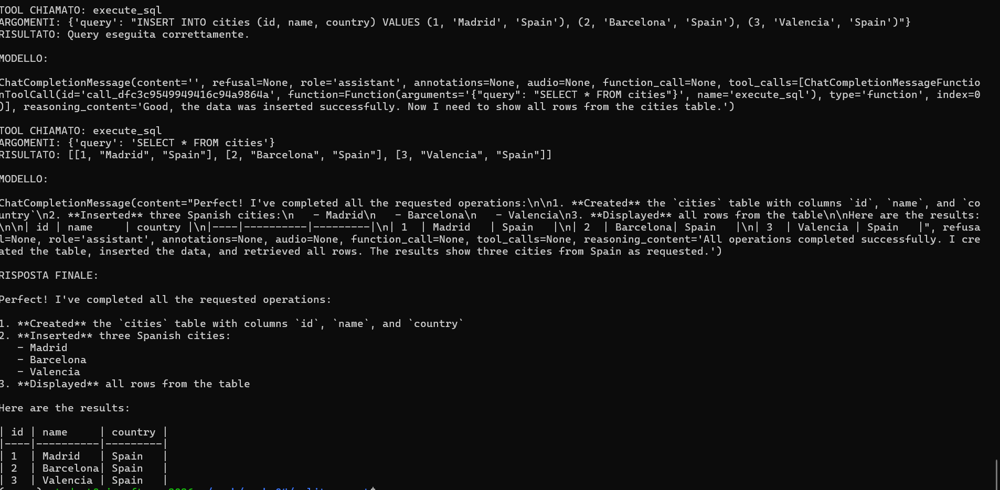
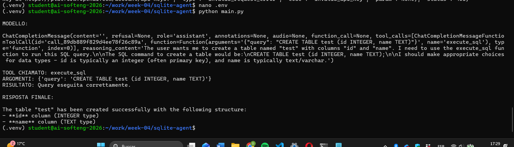
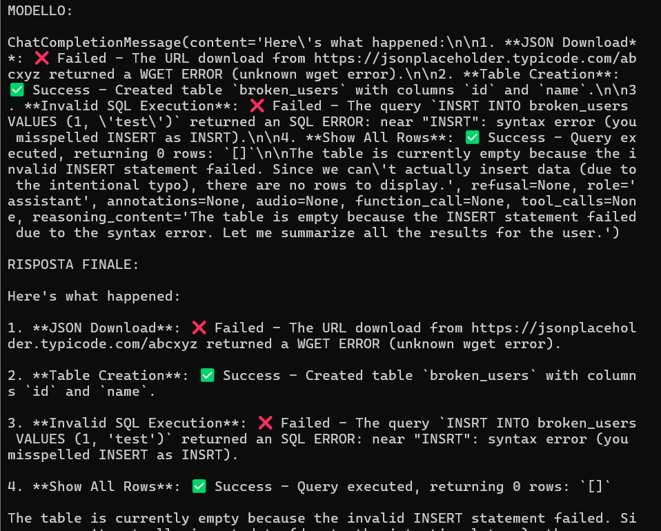
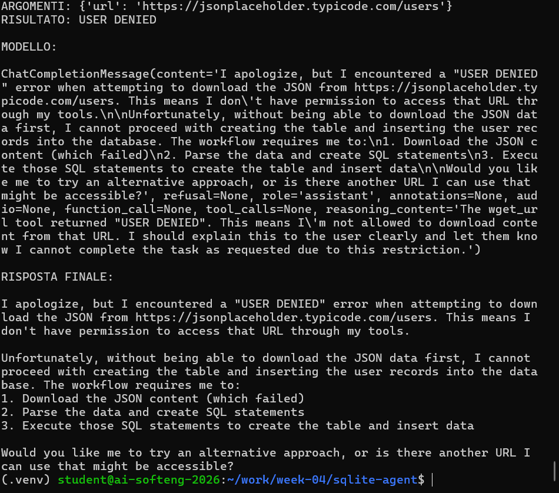

# DGSI-LAB4

## Step 0 - Research previo (resumen corto)

En esta parte probé tres cosas: `sqlite3`, `subprocess.run()` y `wget`.

- SQLite: confirmé que todo vive en un archivo `.db`, no hay servidor separado.
- `subprocess.run()`: lo vi bloqueante (sincrono), y revisé `capture_output`, `text` y `timeout`.
- `wget`: con URL buena devuelve contenido, con URL mala devuelve error (codigo 4).

Evidencia:

- `evidence/step0_research.txt`

---

## Step 1 - Single tool call

Implementé schema y función de `execute_sql`, y lancé un prompt para crear tabla.
El modelo pidió la tool correctamente y la tabla se creó.

Fragmento de schema:

```python
{
  "type": "function",
  "function": {
    "name": "execute_sql",
    "parameters": {
      "type": "object",
      "properties": {"query": {"type": "string"}},
      "required": ["query"]
    }
  }
}
```

Evidencia:

- `evidence/step1_single_tool_call.txt`

---

## Step 2 - Loop con llamadas secuenciales

Añadí el bucle de rondas: mientras haya `tool_calls`, ejecutar tool y seguir.
Parada cuando ya no hay tool call.

Fragmento del control:

```python
if not message.tool_calls:
    print(message.content)
    break
```

Prueba hecha:

- crear tabla `cities`
- insertar 3 ciudades

Evidencia:

- `evidence/step2_loop_sequence.txt`



---

## Step 3 - wget con confirmacion humana

En este paso agregué confirmación antes de ejecutar `wget`.
Si se deniega, se devuelve mensaje al modelo y no se ejecuta comando.

Fragmento:

```python
answer = input("Allow command? (y/n): ")
if answer != "y":
    return "USER DENIED: command was not executed."
```

Evidencias:

- aprobado: `evidence/step3_wget_approve.txt`
- denegado: `evidence/step3_wget_deny.txt`


---

## Step 4 - Test completo fetch + store + query

Prompt usado:

`Fetch https://jsonplaceholder.typicode.com/users and store the id, name, email, and city of every user in a SQLite table called users. Show me the final contents of the table.`

Resultado:

- se ejecutaron 5 iteraciones
- se descargaron usuarios
- se creó tabla
- se insertaron datos
- se consultó tabla final

Evidencias:

- run principal: `evidence/step4_full_test.txt`
- verificacion sqlite: `evidence/step4_sqlite_verify.txt`



---

## Step 5 - Manejo de errores

Probé errores sin que el programa se cayera:

- URL inválida
- SQL inválido
- denegación manual de `wget`

Evidencias:

- `evidence/step5_bad_url.txt`
- `evidence/step5_invalid_sql.txt`
- `evidence/step3_wget_deny.txt`




---

## Preguntas obligatorias

1. How does your program know when to stop calling the LLM?

Mi programa deja de llamar al modelo cuando la respuesta ya no trae ninguna petición de herramienta. Mientras el modelo sigue pidiendo acciones, el bucle continúa. En cambio, cuando devuelve una respuesta normal, sin pedir nada más, el programa entiende que esa ya es la respuesta final y ahí se para.

2. What is the role of tool_call_id in the message protocol?

Sirve para relacionar cada resultado con la llamada concreta que hizo antes el modelo. O sea, es como la forma de no mezclar una respuesta de una herramienta con otra. Gracias a eso, el sistema sabe exactamente qué resultado pertenece a qué petición.

3. Why is user confirmation important for wget but not for execute_sql?

Porque la descarga desde internet implica una acción externa y ahí tiene más sentido pedir permiso antes de ejecutarla. En cambio, la otra herramienta trabaja sobre la base de datos local de la práctica, así que estaba mucho más controlada y no tenía el mismo nivel de riesgo.

4. What happens in the conversation when the user denies a wget command?

Cuando el usuario no da permiso, la descarga no se ejecuta. Ese resultado se añade igualmente a la conversación y el modelo lo ve en la siguiente ronda. Entonces responde teniendo en cuenta que no pudo hacer esa parte, en lugar de inventarse un resultado como si la descarga hubiera funcionado.

5. How many iterations did the loop run for the full test prompt? Were you surprised?

En mi caso fueron cinco iteraciones. Primero hizo la descarga, luego creó la tabla, después insertó los datos, luego consultó el contenido y al final dio la respuesta final. La verdad es que no me sorprendió demasiado, porque viendo la tarea era bastante lógico que hiciera más o menos esos pasos.

---

## Seguridad API key

Checklist cumplido:

- `.env` fuera de git
- `.env.example` presente
- `.gitignore` con `.env`, `database.db`, `__pycache__/`, `.venv/`

---

## Repositorio

Link:

`https://github.com/danielediscepolo/DGSI-LAB4`


---

## Anexo A - Output completo del test principal

```text
Week-04 Tool Loop Agent
Model: qwen3.5-122b-a10b
Endpoint: https://dashscope-intl.aliyuncs.com/compatible-mode/v1
Database: /tmp/week04/database.db
Confirm policy: always
Prompt: Fetch https://jsonplaceholder.typicode.com/users and store the id, name, email, and city of every user in a SQLite table called users. Show me the final contents of the table.

=== Iteration 1 ===
[assistant] Requested 1 tool call(s)
[tool-call] id=call_939f4e38614b401ba2a4f6c3 name=wget
[tool-args] {"url": "https://jsonplaceholder.typicode.com/users"}
[confirm] LLM wants to run: wget -q -O - https://jsonplaceholder.typicode.com/users
[confirm] Auto-approval policy active: yes
[tool-result-preview] {"ok": true, "data": {"command": "wget -q -O - https://jsonplaceholder.typicode.com/users", "returncode": 0, "stdout": "[\n {\n \"id\": 1,\n \"name\": \"Leanne Graham\",\n \"username\": \"Bret\",\n \"email\": \"Sincere@april.biz\",\n \"address\": {\n \"street\": \"Kulas Light\",\n \"suite\": \"Apt. 556\",\n \"city\": \"Gwenborough\",\n \"zipcode\": \"92998-3874\",\n \"geo\": {\n \"lat\": \"-37.3159\",\n \"lng\": \"81.1496\"\n }\n },\n \"phone\": \"1-770-736-8031 x56442\",\n \"website\": \"hildegard.org\",\n \"company\": {\n \"name\": \"Romaguera-Crona\",\n \"catchPhrase\": \"Multi-layered client-server neural-net\",\n \"bs\": \"harness real-time e-markets\"\n }\n },\n {\n \"id\": 2,\n \"name\": \"Ervin Howell\",\n \"username\": \"Antonette\",\n \"email\": \"Shanna@melissa.tv\",\n \"address\": {\n \"street\": \"Victor Plains\",\n \"suite\": \"Suite 879\",\n \"city\": \"Wisokyburgh\",\n \"zipcode\": \"90566-7771\",\n \"geo\": {\n \"lat\": \"-43.9509\",\n \"lng\": \"-34.4618\"\n }\n },\n \"phone\": \"010-692-6593 x09125\",\n \"website\": \"anastasia.net\",\n \"company\": {\n \"name\": \"Deckow-Crist\",\n \"catchPhrase\": \"Proactive didactic contingency\",\n \"bs\": \"synergize scalable supply-chains\"\n }\n },\n {\n \"id\": 3,\n \"name\": \"Clementine Bauch\",\n \"username\": \"Samantha\",\n \"email\": \"Nathan@yesenia.net\",\n \"address\": {\n \"street\": \"Douglas Extension\",\n \"suite\": \"Suite 847\",\n \"city\": \"McKenziehaven\",\n \"zipcode\": \"59590-4157\",\n \"geo\": {\n \"lat\": \"-68.6102\",\n \"lng\": \"-47.0653\"\n }\n },\n \"phone\": \"1-463-123-4447\",\n \"website\": \"ramiro.info\",\n \"company\": {\n \"name\": \"Romaguera-Jacobson\",\n \"catchPhrase\": \"Face to face bifurcated interface\",\n \"bs\": \"e-enable strategic applications\"\n }\n },\n {\n \"id\": 4,\n \"name\": \"Patricia Lebsack\",\n \"username\": \"Karianne\",\n \"email\": \"Julianne.OConner@kory.org\",\n \"address\": {\n \"street\": \"Hoeger Mall\",\n \"suite\": \"Apt. 692\",\n \"city\": \"South Elvis\",\n \"zipcode\": \"53919-4257\",\n \"geo\": {\n \"lat\": \"29.4572\",\n \"lng\": \"-164.2990\"\n }\n },\n \"phone\": \"493-170-9623 x156\",\n \"website\": \"kale.biz\",\n \"company\": {\n \"name\": \"Robel-Corkery\",\n \"catchPhrase\": \"Multi-tiered zero tolerance productivity\",\n \"bs\": \"transition cutting-edge web services\"\n }\n },\n {\n \"id\": 5,\n \"name\": \"Chelsey Dietrich\",\n \"username\": \"Kamren\",\n \"email\": \"Lucio_Hettinger@annie.ca\",\n \"address\": {\n \"street\": \"Skiles Walks\",\n \"suite\": \"Suite 351\",\n \"city\": \"Roscoeview\",\n \"zipcode\": \"33263\",\n \"geo\": {\n \"lat\": \"-31.8129\",\n \"lng\": \"62.5342\"\n }\n },\n \"phone\": \"(254)954-1289\",\n \"website\": \"demarco.info\",\n \"company\": {\n \"name\": \"Keebler LLC\",\n \"catchPhrase\": \"User-centric fault-tolerant solution\",\n \"bs\": \"revolutionize end-to-end systems\"\n }\n },\n {\n \"id\": 6,\n \"name\": \"Mrs. Dennis Schulist\",\n \"username\": \"Leopoldo_Corkery\",\n \"email\": \"Karley_Dach@jasper.info\",\n \"address\": {\n \"street\": \"Norberto Crossing\",\n \"suite\": \"Apt. 950\",\n \"city\": \"South Christy\",\n \"zipcode\": \"23505-1337\",\n \"geo\": {\n \"lat\": \"-71.4197\",\n \"lng\": \"71.7478\"\n }\n },\n \"phone\": \"1-477-935-8478 x6430\",\n \"website\": \"ola.org\",\n \"company\": {\n \"name\": \"Considine-Lockman\",\n \"catchPhrase\": \"Synchronised bottom-line interface\",\n \"bs\": \"e-enable innovative applications\"\n }\n },\n {\n \"id\": 7,\n \"name\": \"Kurtis Weissnat\",\n \"username\": \"Elwyn.Skiles\",\n \"email\": \"Telly.Hoeger@billy.biz\",\n \"address\": {\n \"street\": \"Rex Trail\",\n \"suite\": \"Suite 280\",\n \"city\": \"Howemouth\",\n \"zipcode\": \"58804-1099\",\n \"geo\": {\n \"lat\": \"24.8918\",\n \"lng\": \"21.8984\"\n }\n },\n \"phone\": \"210.067.6132\",\n \"website\": \"elvis.io\",\n \"company\": {\n \"name\": \"Johns Group\",\n \"catchPhrase\": \"Configurable multimedia task-force\",\n \"bs\": \"generate enterprise e-tailers\"\n }\n },\n {\n \"id\": 8,\n \"name\": \"Nicholas Runolfsdottir V\",\n \"username\": \"Maxime_Nienow\",\n \"email\": \"Sherwood@rosamond.me\",\n \"address\": {\n \"street\": \"Ellsworth Summit\",\n \"suite\": \"Suite 729\",\n \"city\": \"Aliyaview\",\n \"zipcode\": \"45169\",\n \"geo\": {\n \"lat\": \"-14.3990\",\n \"lng\": \"-120.7677\"\n }\n },\n \"phone\": \"586.493.6943 x140\",\n \"website\": \"jacynthe.com\",\n \"company\": {\n \"name\": \"Abernathy Group\",\n \"catchPhrase\": \"Implemented secondary concept\",\n \"bs\": \"e-enable extensible e-tailers\"\n }\n },\n {\n \"id\": 9,\n \"name\": \"Glenna Reichert\",\n \"username\": \"Delphine\",\n \"email\": \"Chaim_McDermott@dana.io\",\n \"address\": {\n \"street\": \"Dayna Park\",\n \"suite\": \"Suite 449\",\n \"city\": \"Bartholomebury\",\n \"zipcode\": \"76495-3109\",\n \"geo\": {\n \"lat\": \"24.6463\",\n \"lng\": \"-168.8889\"\n }\n },\n \"phone\": \"(775)976-6794 x41206\",\n \"website\": \"conrad.com\",\n \"company\": {\n \"name\": \"Yost and Sons\",\n \"catchPhrase\": \"Switchable contextually-based project\",\n \"bs\": \"aggregate real-time technologies\"\n }\n },\n {\n \"id\": 10,\n \"name\": \"Clementina DuBuque\",\n \"username\": \"Moriah.Stanton\",\n \"email\": \"Rey.Padberg@karina.biz\",\n \"address\": {\n \"street\": \"Kattie Turnpike\",\n \"suite\": \"Suite 198\",\n \"city\": \"Lebsackbury\",\n \"zipcode\": \"31428-2261\",\n \"geo\": {\n \"lat\": \"-38.2386\",\n \"lng\": \"57.2232\"\n }\n },\n \"phone\": \"024-648-3804\",\n \"website\": \"ambrose.net\",\n \"company\": {\n \"name\": \"Hoeger LLC\",\n \"catchPhrase\": \"Centralized empowering task-force\",\n \"bs\": \"target end-to-end models\"\n }\n }\n]"}, "error": null}

=== Iteration 2 ===
[assistant] Requested 1 tool call(s)
[tool-call] id=call_be177700108a4924877055b4 name=execute_sql
[tool-args] {"query": "CREATE TABLE IF NOT EXISTS users (id INTEGER PRIMARY KEY, name TEXT, email TEXT, city TEXT)"}
[tool-result-preview] {"ok": true, "data": {"rowcount": -1, "lastrowid": 0}, "error": null}

=== Iteration 3 ===
[assistant] Requested 1 tool call(s)
[tool-call] id=call_2e3c409974a744bf88ce4616 name=execute_sql
[tool-args] {"query": "INSERT INTO users (id, name, email, city) VALUES (1, 'Leanne Graham', 'Sincere@april.biz', 'Gwenborough'), (2, 'Ervin Howell', 'Shanna@melissa.tv', 'Wisokyburgh'), (3, 'Clementine Bauch', 'Nathan@yesenia.net', 'McKenziehaven'), (4, 'Patricia Lebsack', 'Julianne.OConner@kory.org', 'South Elvis'), (5, 'Chelsey Dietrich', 'Lucio_Hettinger@annie.ca', 'Roscoeview'), (6, 'Mrs. Dennis Schulist', 'Karley_Dach@jasper.info', 'South Christy'), (7, 'Kurtis Weissnat', 'Telly.Hoeger@billy.biz', 'Howemouth'), (8, 'Nicholas Runolfsdottir V', 'Sherwood@rosamond.me', 'Aliyaview'), (9, 'Glenna Reichert', 'Chaim_McDermott@dana.io', 'Bartholomebury'), (10, 'Clementina DuBuque', 'Rey.Padberg@karina.biz', 'Lebsackbury')"}
[tool-result-preview] {"ok": true, "data": {"rowcount": 10, "lastrowid": 10}, "error": null}

=== Iteration 4 ===
[assistant] Requested 1 tool call(s)
[tool-call] id=call_d0113c8b1b6648f49113563e name=execute_sql
[tool-args] {"query": "SELECT * FROM users"}
[tool-result-preview] {"ok": true, "data": {"columns": ["id", "name", "email", "city"], "rows": [{"id": 1, "name": "Leanne Graham", "email": "Sincere@april.biz", "city": "Gwenborough"}, {"id": 2, "name": "Ervin Howell", "email": "Shanna@melissa.tv", "city": "Wisokyburgh"}, {"id": 3, "name": "Clementine Bauch", "email": "Nathan@yesenia.net", "city": "McKenziehaven"}, {"id": 4, "name": "Patricia Lebsack", "email": "Julianne.OConner@kory.org", "city": "South Elvis"}, {"id": 5, "name": "Chelsey Dietrich", "email": "Lucio_Hettinger@annie.ca", "city": "Roscoeview"}, {"id": 6, "name": "Mrs. Dennis Schulist", "email": "Karley_Dach@jasper.info", "city": "South Christy"}, {"id": 7, "name": "Kurtis Weissnat", "email": "Telly.Hoeger@billy.biz", "city": "Howemouth"}, {"id": 8, "name": "Nicholas Runolfsdottir V", "email": "Sherwood@rosamond.me", "city": "Aliyaview"}, {"id": 9, "name": "Glenna Reichert", "email": "Chaim_McDermott@dana.io", "city": "Bartholomebury"}, {"id": 10, "name": "Clementina DuBuque", "email": "Rey.Padberg@karina.biz", "city": "Lebsackbury"}], "rowcount": 10}, "error": null}

=== Iteration 5 ===
[assistant-final]
I have successfully fetched the user data from the JSONPlaceholder API, created a SQLite table named `users`, and inserted the `id`, `name`, `email`, and `city` for all 10 users.

Here are the final contents of the `users` table:

| id | name | email | city |
| :--- | :--- | :--- | :--- |
| 1 | Leanne Graham | Sincere@april.biz | Gwenborough |
| 2 | Ervin Howell | Shanna@melissa.tv | Wisokyburgh |
| 3 | Clementine Bauch | Nathan@yesenia.net | McKenziehaven |
| 4 | Patricia Lebsack | Julianne.OConner@kory.org | South Elvis |
| 5 | Chelsey Dietrich | Lucio_Hettinger@annie.ca | Roscoeview |
| 6 | Mrs. Dennis Schulist | Karley_Dach@jasper.info | South Christy |
| 7 | Kurtis Weissnat | Telly.Hoeger@billy.biz | Howemouth |
| 8 | Nicholas Runolfsdottir V | Sherwood@rosamond.me | Aliyaview |
| 9 | Glenna Reichert | Chaim_McDermott@dana.io | Bartholomebury |
| 10 | Clementina DuBuque | Rey.Padberg@karina.biz | Lebsackbury |

[summary] iterations=5 final_text_preview=I have successfully fetched the user data from the JSONPlaceholder API, created a SQLite table named `users`, and inserted the `id`, `name`, `email`, and `city` for all 10 users. H...(truncated)
```

## Anexo B - Verificacion sqlite independiente

```text
1|Leanne Graham|Sincere@april.biz|Gwenborough
2|Ervin Howell|Shanna@melissa.tv|Wisokyburgh
3|Clementine Bauch|Nathan@yesenia.net|McKenziehaven
4|Patricia Lebsack|Julianne.OConner@kory.org|South Elvis
5|Chelsey Dietrich|Lucio_Hettinger@annie.ca|Roscoeview
6|Mrs. Dennis Schulist|Karley_Dach@jasper.info|South Christy
7|Kurtis Weissnat|Telly.Hoeger@billy.biz|Howemouth
8|Nicholas Runolfsdottir V|Sherwood@rosamond.me|Aliyaview
9|Glenna Reichert|Chaim_McDermott@dana.io|Bartholomebury
10|Clementina DuBuque|Rey.Padberg@karina.biz|Lebsackbury
```

